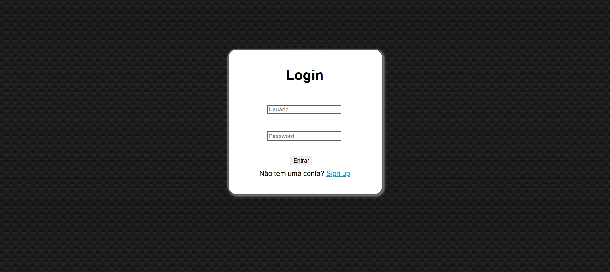
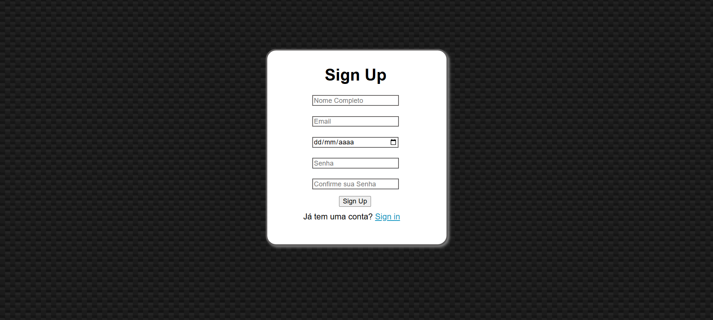

# Tela de Login e Cadastro

 


## Sobre o Projeto
Este projeto foi desenvolvido para praticar e exercitar conhecimentos em **HTML** e **CSS**. Ele consiste em uma interface de usuário simples e funcional, com páginas separadas para **login** e **cadastro**. 

### Funcionalidades
- Organização de arquivos HTML e CSS para fácil manutenção.
- Estilização básica para uma experiência amigável.

## Layout do Projeto

> **Login Page**  
  

> **Cadastro Page**  


## Estrutura de Arquivos
```plaintext
├── login.html           # Página de Login
├── cadastro.html        # Página de Cadastro
└── style.css            # Arquivo de Estilos
